# 知识库关系图谱总览

## 标准识别区

- 输入ID：20260609-graph-map
- 输入时间：2026-06-09
- 来源类型：知识库结构整理
- 来源名称：Vault 关系图谱去重
- 作者 / 机构：Codex
- 原始日期：2026-06-09
- 原始链接：本地 Vault
- 项目归属：X
- 内容类型：结构标准 / 关系图谱 / 命名规范
- 目标输出：知识库结构标准
- 处理指令：整理 / 清理 / 归档
- 分类动作：X / C
- 优先级：高
- 状态：已入库
- 标签：#关系图谱 #节点去重 #Obsidian #知识库标准

## 一句话摘要

本页是全 Vault 的关系图谱入口，用于统一项目、共享资料、知识卡、输出成果和复盘之间的连接方式；同名节点不直接删除，优先用路径链接和括号备注消除歧义。

## 主关系图

```mermaid
graph TD
  A["欢迎 / 使用入口"] --> B["输入标准与指令识别"]
  A --> C["项目总览"]
  A --> D["自动知识库工作流"]
  A --> E["关系图谱总览"]

  C --> P1["项目首页（P1客栈自媒体）"]
  C --> P2["项目首页（P2生物信息）"]
  C --> P3["项目首页（P3课程日常）"]
  C --> P4["项目首页（P4 AI工具）"]
  C --> P5["项目首页（P5其他杂事）"]
  C --> X["共享资料（跨项目复用）"]

  B --> I["00_Inbox（信息入口）"]
  B --> K["02_Knowledge（知识卡片）"]
  B --> T["03_Topics（选题与专题）"]
  B --> O["04_Outputs（输出成果）"]
  B --> R["05_Review（复盘迭代）"]
  B --> S["06_Skills（规则与方法）"]

  P1 --> H["p1horizon（客栈网站项目）"]
  H --> H0["p1horizon项目当前进展（原始收集）"]
  H --> H1["p1horizon项目当前进展-入库整理（P1项目收件箱）"]
  H --> H2["p1horizon客栈网站项目案例卡（案例沉淀）"]
  H --> H3["客栈素材到线上展示全流程方法卡（方法沉淀）"]
  H --> H4["客栈官网第一版应优先转化而非复杂内容管理（观点沉淀）"]
  H --> H5["p1horizon首批内容选题池（选题）"]
  H --> H6["p1horizon首批短视频脚本（视频脚本）"]
  H --> H7["p1horizon项目当前进展报告（阶段报告）"]
  H --> H8["2026-06-09-p1horizon全流程周报（周报）"]
  H --> H9["2026-06-09-p1horizon项目简报（每日简报）"]

  P2 --> Bio["第2-3周研究进展资料包总览"]
  Bio --> BioK["microRNA / NGS / 药物预测知识卡"]

  P4 --> Std["通用信息收集系统标准架构与执行流程"]
  Std --> Web["网站上线方法与网页架构标准"]
  Std --> Checklist["信息收集系统搭建检查清单"]
```

## 关系入口

| 类型 | 入口节点 | 说明 |
| --- | --- | --- |
| Vault 总入口 | [[../../欢迎|欢迎 / 使用入口]] | 只放最常用入口，不承载具体项目细节。 |
| 项目总入口 | [[../../10_Projects/项目总览|项目总览]] | 五个项目和共享区的主导航。 |
| 输入标准 | [[../../06_Skills/知识库输入标准与指令识别规范|输入标准与指令识别]] | 全库唯一字段标准和清理规则。 |
| 工作流 | [[../../06_Skills/自动知识库工作流|自动知识库工作流]] | 信息从收集到输出的执行链路。 |
| P1 当前主链路 | [[../../10_Projects/01_客栈自媒体脚本与热点/00_项目收件箱/p1horizon项目当前进展-入库整理|p1horizon项目当前进展-入库整理（P1项目收件箱）]] | P1 horizon 项目的结构化入库主节点。 |
| P4 通用标准 | [[../../10_Projects/04_AI前沿与Codex工具/04_可复用工作流/通用信息收集系统标准架构与执行流程|通用信息收集系统标准架构与执行流程]] | 后续所有信息收集系统的搭建标准。 |

## 同名节点处理

| 重复名 | 保留方式 | 标准显示名 |
| --- | --- | --- |
| `项目首页` | 不改文件名；所有跨页链接必须带路径和括号备注。 | `项目首页（P1客栈自媒体）`、`项目首页（P2生物信息）`、`项目首页（P3课程日常）`、`项目首页（P4 AI工具）`、`项目首页（P5其他杂事）` |
| `周报模板` | 保留模板库和输出目录两份；引用时说明用途。 | `周报模板（模板库）`、`周报模板（输出目录）` |
| `p1horizon项目当前进展` | 保留原始收集、入库整理、阶段报告三类节点；用括号标注阶段。 | `p1horizon项目当前进展（原始收集）`、`p1horizon项目当前进展-入库整理（P1项目收件箱）`、`p1horizon项目当前进展报告（阶段报告）` |

## P1 horizon 节点链路

| 阶段 | 节点 | 用途 |
| --- | --- | --- |
| 原始收集 | [[../../00_Inbox/p1horizon项目当前进展|p1horizon项目当前进展（原始收集）]] | 保留本地项目路径、素材盘点、代码状态和验证结果。 |
| 项目入库 | [[../../10_Projects/01_客栈自媒体脚本与热点/00_项目收件箱/p1horizon项目当前进展-入库整理|p1horizon项目当前进展-入库整理（P1项目收件箱）]] | P1 项目内的结构化主节点。 |
| 案例卡 | [[../../02_Knowledge/案例卡片/p1horizon客栈网站项目案例卡|p1horizon客栈网站项目案例卡（案例沉淀）]] | 沉淀客栈网站项目案例。 |
| 方法卡 | [[../../02_Knowledge/方法论卡片/客栈素材到线上展示全流程方法卡|客栈素材到线上展示全流程方法卡（方法沉淀）]] | 沉淀素材到网页展示的通用方法。 |
| 观点卡 | [[../../02_Knowledge/观点卡片/客栈官网第一版应优先转化而非复杂内容管理|客栈官网第一版应优先转化而非复杂内容管理（观点沉淀）]] | 固定第一版官网的产品判断。 |
| 选题 | [[../选题池/p1horizon首批内容选题池|p1horizon首批内容选题池（选题）]] | 后续短视频和图文输出入口。 |
| 脚本 | [[../../04_Outputs/视频脚本/p1horizon首批短视频脚本|p1horizon首批短视频脚本（视频脚本）]] | 可直接进入拍摄和发布的脚本文档。 |
| 文章 | [[../../04_Outputs/文章/从客栈素材到线上展示页-p1horizon复盘文章|从客栈素材到线上展示页-p1horizon复盘文章（文章）]] | 可发布或复盘的文章稿。 |
| 报告 | [[../../04_Outputs/报告/p1horizon项目当前进展报告|p1horizon项目当前进展报告（阶段报告）]] | 项目阶段汇报主输出。 |
| 周报 | [[../../04_Outputs/周报总结/2026-06-09-p1horizon全流程周报|2026-06-09-p1horizon全流程周报（周报）]] | 周报初始化和项目进展汇总。 |
| 简报 | [[../../05_Review/每日简报/2026-06-09-p1horizon项目简报|2026-06-09-p1horizon项目简报（每日简报）]] | 当日行动提醒。 |

## 后续新增系统的节点命名标准

### 必须固定的主节点

每个新的信息收集系统至少建立 5 个节点：

| 节点 | 命名格式 | 说明 |
| --- | --- | --- |
| 项目首页 | `项目首页（项目代码 项目简称）` | 项目的导航和长期目标。 |
| 原始入口 | `项目名当前资料（原始收集）` | 保留最完整原始信息。 |
| 入库整理 | `项目名当前资料-入库整理（项目收件箱）` | 清洗后的结构化主节点。 |
| 标准流程 | `项目名信息收集工作流（执行标准）` | 该项目的抓取、筛选、归档和输出规则。 |
| 输出索引 | `项目名输出索引（成果总览）` | 文章、报告、脚本、周报等交付件入口。 |

### 需要特殊标注的地方

- 同名文件不强制重命名，但跨页链接必须使用 `［［路径/文件名｜显示名（备注）］］` 这种结构。
- 同一项目的原始资料、入库整理、报告、周报可以并存，但必须用括号标注阶段。
- 知识卡如果来自同一资料包，标题要体现卡片类型，例如 `案例卡`、`方法卡`、`观点卡`、`工具卡`。
- 低重要性同步副本不进入图谱；如果必须保留，要写明 `（临时）` 或 `（待合并）`。
- 附件节点只作为证据存在，不作为主导航节点；主导航必须指向入库笔记或资料包总览。

## 当前清理结论

- 已修正 `10_Projects/项目总览` 中项目链接的别名格式。
- 已将 5 个 `项目首页` 的显示名统一为带项目备注的节点。
- 已为 `周报模板` 和 `p1horizon项目当前进展` 这类必要近名节点补充括号备注。
- 未删除高重要性资料；P1 horizon 的原始收集、项目入库、报告、周报和简报被保留为不同阶段节点。

## 下一步动作

- 新增项目时，先复制本页的“后续新增系统的节点命名标准”。
- 每次批量入库后，检查是否出现新的同名文件或无备注近名文件。
- 如果某个临时节点已被报告或知识卡完全覆盖，再按 `06_Skills/知识库输入标准与指令识别规范.md` 的去重规则合并或删除。
