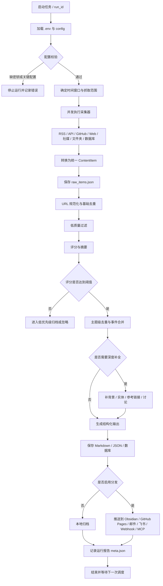

# 通用信息收集系统标准架构与执行流程

## 标准识别区

- 输入ID：20260608-p4-universal-info-collection-standard
- 输入时间：2026-06-08 00:00
- 来源类型：文档
- 来源名称：AI信息收集项目标准架构与工作流-原始资料.md
- 作者 / 机构：Codex
- 原始日期：2026-06-08
- 原始链接：暂无
- 项目归属：P4
- 内容类型：资料
- 目标输出：文章 / 报告 / 课程 / 周报
- 处理指令：整理
- 分类动作：P
- 优先级：高
- 状态：已入库
- 标签：P4, 信息收集系统, 标准架构, 工作流, 可复用工作流

## 一句话摘要

一个可复用的信息收集系统，本质是一条“多源采集 -> 标准化 -> 清洗去重 -> 评分筛选 -> 深度补全 -> 结构化输出 -> 分发归档 -> 运行观测”的稳定流水线；AI 信息收集只是其中一种特化场景。

## 适用范围

本标准不只用于 AI 信息收集系统，也适用于后续任何新的信息收集系统，例如：

- AI 行业日报。
- 客栈热点和短视频选题雷达。
- 生物信息文献追踪。
- 课程资料和作业提醒系统。
- 竞品监控。
- 社媒舆情观察。
- 开源项目追踪。
- 论文/招聘/政策/金融/产品信息监测。

## 总体架构

标准信息收集项目应至少包含 10 个模块：

| 层级 | 模块 | 作用 | 特殊标注 |
| --- | --- | --- | --- |
| 1 | 项目目标层 | 定义收集什么、为谁服务、输出什么 | `[特异性配置]` |
| 2 | 配置中心 | 管理信息源、时间窗口、阈值、模型、输出渠道 | `[安全红线]` 密钥不得入库 |
| 3 | 信息源注册表 | 维护 RSS、API、网页、社媒、数据库、文件夹等来源 | `[可插拔]` 来源必须可独立开关 |
| 4 | 采集器层 | 按来源抓取原始内容 | `[鲁棒性要求]` 单源失败不拖垮全局 |
| 5 | 统一内容模型 | 把不同来源转成统一字段 | `[通用核心]` 所有系统必须有 |
| 6 | 清洗与去重 | URL 去重、低质过滤、主题合并 | `[质量控制]` 防止日报被重复内容污染 |
| 7 | 评分与筛选 | 按规则或 AI 进行重要性评分 | `[特异性配置]` 评分维度随领域变化 |
| 8 | 深度补全 | 背景、实体、关联事件、社区讨论、参考链接 | `[成本控制]` 只对高分内容执行 |
| 9 | 输出与分发 | 生成 Markdown、JSON、日报、选题库、API、Webhook | `[可插拔]` 输出渠道可替换 |
| 10 | 运行观测 | 记录数量、错误、耗时、token、成本、推送状态 | `[生产必需]` 没日志就不可维护 |

## 标准执行流程图



## 统一内容模型

所有信息收集系统都必须把原始内容转换成统一模型。字段未知时写 `null` 或 `待补`，不要改字段名。

```json
{
  "id": "source_type:native_id_or_hash",
  "source_type": "rss/github/web/social/api/database/local_file/manual",
  "source_name": "",
  "title": "",
  "url": "",
  "content": "",
  "author": "",
  "published_at": "",
  "fetched_at": "",
  "language": "zh/en/mixed/unknown",
  "project": "P1/P2/P3/P4/P5/X/待判断",
  "content_type": "news/paper/project/post/video/document/dataset/other",
  "metadata": {},
  "score": null,
  "score_reason": "",
  "summary": "",
  "tags": [],
  "dedupe_key": "",
  "canonical_id": "",
  "status": "raw/scored/filtered/enriched/generated/archived/ignored"
}
```

## 标准目录模板

任何新的信息收集项目建议采用以下目录：

```text
project-name/
  README.md
  AGENTS.md
  config/
    config.example.json
    sources.example.json
    scoring.example.json
  src/
    collectors/
    normalizers/
    dedupe/
    scoring/
    enrichment/
    generation/
    distribution/
    storage/
  data/
    runs/
    raw/
    scored/
    filtered/
    enriched/
    generated/
  outputs/
    daily/
    weekly/
    topics/
    reports/
  logs/
  tests/
  docs/
```

## 标准运行阶段

| 阶段 | 输入 | 输出 | 必做检查 | 特殊标注 |
| --- | --- | --- | --- | --- |
| 初始化 | `.env`、config | run_id、运行目录 | 密钥、路径、时间窗口 | `[安全红线]` |
| 采集 | source registry | raw items | 单源限额、错误捕获 | `[鲁棒性要求]` |
| 标准化 | raw items | ContentItem | 字段完整性 | `[通用核心]` |
| 清洗去重 | ContentItem | raw_items.json | URL 和标题去重 | `[质量控制]` |
| 评分筛选 | raw_items.json | scored/filtered items | 阈值、评分理由 | `[特异性配置]` |
| 主题合并 | filtered items | canonical items | 同事件合并 | `[鲁棒性要求]` |
| 深度补全 | high-score items | enriched items | 参考链接、来源可信度 | `[成本控制]` |
| 内容生成 | enriched items | Markdown/JSON | 格式、长度、引用 | `[输出适配]` |
| 分发归档 | generated files | 推送结果 | 渠道成功率 | `[可插拔]` |
| 观测复盘 | meta/logs | run report | token、错误、数量 | `[生产必需]` |

## 特异性与鲁棒性原则

### 特异性

每个系统必须明确：

- 目标用户是谁。
- 关注领域是什么。
- 高价值内容的判断标准是什么。
- 输出物是什么：日报、选题、报告、脚本、课程资料、预警。
- 什么内容必须人工确认。

示例：

- AI 信息收集：模型发布、开源项目、技术趋势优先。
- 客栈热点系统：平台热点、旅行趋势、同城活动、对标账号优先。
- 生物信息文献系统：论文、数据库、工具、实验机制、课程要求优先。

### 鲁棒性

每个系统必须做到：

- 单个来源失败不影响其他来源。
- AI 调用失败不影响基础归档。
- 输出渠道失败不影响本地保存。
- 支持从中间阶段重跑。
- 所有密钥走环境变量。
- 保存运行日志和中间产物。
- 支持人工复核和手动覆盖。

## 特殊标注规范

以后所有信息收集项目文档中，必须使用以下标注：

- `[安全红线]`：密钥、token、cookie、Webhook、隐私数据，禁止入库。
- `[人工确认]`：高风险新闻、医学/法律/金融结论、公开发布前内容。
- `[特异性配置]`：领域相关、项目相关、用户相关的规则。
- `[鲁棒性要求]`：失败回退、降级运行、重试、不中断主流程。
- `[成本控制]`：AI token、搜索 API、付费接口、抓取频率。
- `[可插拔]`：来源、模型、输出渠道、存储后端可替换。
- `[MVP]`：最小可用版本必须实现。
- `[生产必需]`：上线长期运行必须实现。

## 最小可用版本

```text
配置中心
  -> 3-5 个稳定信息源
  -> 统一内容模型
  -> URL 去重
  -> 规则或 AI 评分
  -> Markdown 输出
  -> 本地归档
  -> 运行日志
```

## 完整生产版本

```text
多源采集
  -> 标准化
  -> URL 去重
  -> 主题去重
  -> AI 评分
  -> 高分内容背景补全
  -> 多格式输出
  -> 多渠道分发
  -> MCP/API
  -> 定时调度
  -> 成本和错误监控
  -> 人工复核闭环
```

## Codex 五项检查

- 相关性：高，服务 P4 和所有未来信息收集系统搭建。
- 新鲜度：高，基于 2026-06-08 新整理的 Horizon 参考架构。
- 价值度：高，可作为新项目启动模板。
- 可输出性：高，可转化为项目 README、AGENTS、开发计划和检查清单。
- 关联性：关联 AI 信息收集、客栈热点、P2 文献追踪和 Obsidian 自动知识库。

## 推荐去向

- 保存路径：`10_Projects/04_AI前沿与Codex工具/04_可复用工作流`
- 关联笔记：[[信息收集项目标准模板]]、[[信息收集系统搭建检查清单]]
- 下一步动作：按该标准为 P4 AI 信息收集系统建立具体项目配置。
