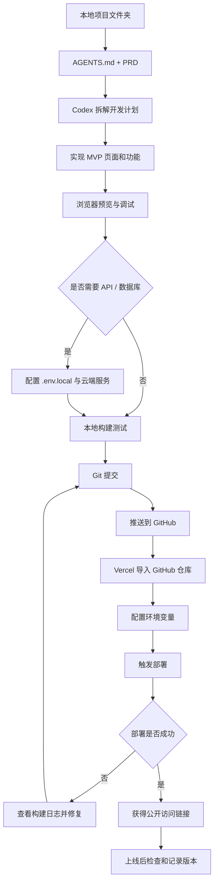

# 网站上线方法与网页架构标准

## 标准识别区

- 输入ID：20260609-shared-website-launch-architecture-standard
- 输入时间：2026-06-09 13:05
- 来源类型：手动记录 / 文档
- 来源名称：已粘贴的文本.txt
- 作者 / 机构：Codex 整理
- 原始日期：2026-06-09
- 原始链接：暂无
- 项目归属：X
- 内容类型：资料
- 目标输出：文章 / 报告 / 课程 / 暂无
- 处理指令：整理
- 分类动作：X
- 优先级：高
- 状态：已入库
- 标签：网站上线, 网页架构, GitHub, Vercel, Vibe Coding, AI开发

## 一句话摘要

网站上线的通用流程是：先明确需求和页面架构，再让 Codex 按计划开发，过程中用浏览器预览和 Git 存档控制质量，最后把代码推送到 GitHub，并由 Vercel 拉取仓库完成部署上线。

## 适用范围

本标准适用于以后所有需要上线的网站项目，包括但不限于：

- 静态展示网站。
- 工具型 Web App。
- 数据看板。
- 内容站点。
- 交互式作品集。
- 小型 SaaS 原型。
- 需要地图、数据库、API 或登录功能的网站。

本标准不依赖特定项目类型，不保留原始文档里的项目细节。

## 一、网站项目通用开发流程

### 1. 新建独立项目文件夹

每个网站项目都应有独立目录。

```text
project-name/
  AGENTS.md
  README.md
  docs/
  src/
  public/
  package.json
  .env.example
  .gitignore
```

要求：

- 文件夹建议使用英文名。
- 一个项目一个仓库，避免多个网站混在同一目录。
- 开发前先绑定到 Codex 或本地编辑器。
- 不要让 AI 在不相关目录中改文件。

### 2. 建立 AGENTS.md

`AGENTS.md` 是项目行为规则，建议每个网站项目都创建。

应包含：

- 项目目标。
- 技术栈。
- 设计风格。
- 文件夹职责。
- 不允许删除的文件。
- 开发和测试命令。
- 部署方式。
- 密钥和隐私规则。

示例提示词：

```text
请为这个网站项目创建 AGENTS.md。
要求：
- 用清楚易懂的话说明项目目标
- 约定文件夹职责
- 说明不要乱删文件
- 写明开发、测试、构建、部署命令
- 明确密钥只放环境变量，不写入 Git
```

### 3. 先写 PRD，再写代码

不要一开始就让 AI 写代码。先写 PRD，把需求说清楚。

PRD 必须包含：

- 项目背景。
- 目标用户。
- 用户痛点。
- 核心使用流程。
- 第一版 MVP 功能。
- 页面列表。
- 每个页面展示什么。
- 数据从哪里来。
- 哪些内容可以用 AI 生成示意数据。
- 哪些功能以后再做。
- 风险和注意事项。
- 开发顺序。

### 4. 开启计划模式或先让 AI 拆任务

复杂网站项目必须先拆解计划。

适合先计划的任务：

- 多页面网站。
- 需要 API。
- 需要数据库。
- 需要部署。
- 需要复杂交互。
- 需要移动端适配。

审核计划时重点看：

- 有没有漏掉页面。
- 有没有误解功能。
- 有没有错误技术方案。
- 是否先做 MVP，而不是一次做太大。

### 5. 分窗口或分任务开发

一个对话只做一类任务，避免上下文混乱。

推荐拆分：

- 页面结构。
- 视觉设计。
- 数据模型。
- API 接入。
- 数据库接入。
- 前端调试。
- 部署上线。
- Bug 修复。

### 6. 浏览器预览和注释微调

网页项目必须打开浏览器看效果。

检查内容：

- 桌面端是否正常。
- 移动端是否正常。
- 文字是否溢出。
- 按钮是否可点击。
- 图片是否加载。
- 表单是否可提交。
- 页面是否空白。
- 控制台是否报错。

如果能使用浏览器注释功能，优先在页面上直接点选问题区域，让 AI 定位修改。

### 7. Git 存档

每次大改前后都要提交 Git。

建议提交节点：

- 初始化项目。
- 完成 PRD。
- 完成首页。
- 完成核心功能。
- 接入 API。
- 接入数据库。
- 修复重要 Bug。
- 部署前。
- 部署成功后。

常用命令：

```powershell
git status
git add .
git commit -m "描述本次改动"
git push
```

## 二、网页网站架构标准

### 1. 标准目录结构

不同框架目录略有差异，但职责应清晰。

```text
project-name/
  public/                 静态资源
  src/
    app/ or pages/         页面路由
    components/            可复用组件
    features/              按业务功能组织的模块
    layouts/               页面布局
    styles/                全局样式和主题
    lib/                   通用工具函数
    services/              API 请求和外部服务
    data/                  示例数据或静态数据
    hooks/                 前端状态和复用逻辑
    types/                 类型定义
  docs/                    PRD、架构说明、部署说明
  tests/                   测试
  .env.example             环境变量示例
  .gitignore
  package.json
  README.md
  AGENTS.md
```

### 2. 页面架构

每个网站至少要明确：

| 层级 | 说明 |
| --- | --- |
| 路由层 | URL 和页面对应关系 |
| 页面层 | 每个页面负责什么用户任务 |
| 布局层 | Header、Footer、Sidebar、主内容区 |
| 组件层 | Button、Card、Table、Form、Modal 等 |
| 数据层 | 本地数据、API 数据、数据库数据 |
| 状态层 | 登录状态、筛选状态、表单状态、加载状态 |
| 样式层 | 颜色、字号、间距、响应式规则 |
| 部署层 | 构建命令、环境变量、托管平台 |

### 3. MVP 页面清单

任何网站第一版建议先做 MVP。

```text
首页：
  告诉用户这是什么，能做什么，如何进入核心流程。

核心功能页：
  承载网站最重要的一件事。

详情页：
  展示单个对象的完整信息。

设置/表单页：
  如果需要输入、筛选、配置，在这里完成。

错误页：
  404、加载失败、无数据状态。
```

### 4. 数据架构

开发前要明确数据来源。

```text
静态示例数据：
  适合 demo、作品集、早期 MVP。

本地 JSON / Markdown：
  适合内容站、资料库、轻量项目。

第三方 API：
  适合地图、天气、支付、搜索、AI、数据服务。

云端数据库：
  适合用户数据、收藏、评论、后台管理、长期运行。
```

### 5. API 和数据库标准

如果网站需要外部 API 或数据库，必须做到：

- API Key 不写进代码。
- 本地使用 `.env.local`。
- 线上在 Vercel 环境变量中配置。
- 仓库只提交 `.env.example`。
- 后端接口要有错误处理。
- 前端要有加载、失败、空数据状态。

`.env.example` 示例：

```text
NEXT_PUBLIC_SITE_URL=
DATABASE_URL=
MAP_API_KEY=
OPENAI_API_KEY=
```

注意：真实密钥不要写入 `.env.example`。

### 6. 视觉和交互标准

网站上线前至少检查：

- 是否有清晰的信息层级。
- 是否适配手机和桌面。
- 文字是否可读。
- 按钮是否有 hover/active 状态。
- 表单是否有错误提示。
- 加载状态是否明确。
- 空数据状态是否明确。
- 图片是否有固定尺寸，避免布局跳动。
- 主要流程是否 3 步内可完成。

## 三、网站上线标准流程

### 总流程



### 1. 本地构建检查

上线前先在本地运行：

```powershell
npm install
npm run build
npm run dev
```

如果项目不是 npm 技术栈，则替换为对应构建命令。

必须确认：

- 本地能启动。
- 构建无错误。
- 页面无明显控制台报错。
- 核心功能可操作。

### 2. 推送 GitHub

第一次上线前，需要把代码推送到 GitHub。

流程：

```text
1. GitHub 新建空仓库。
2. 本地设置 remote。
3. 提交代码。
4. 推送到 GitHub。
```

常用命令：

```powershell
git init
git remote add origin git@github.com:username/repo.git
git add .
git commit -m "Initial website"
git push -u origin main
```

如果默认分支是 `master`，则用：

```powershell
git push -u origin master
```

### 3. Vercel 部署

Vercel 通用步骤：

```text
1. 登录 Vercel。
2. New Project。
3. Import Git Repository。
4. 选择 GitHub 仓库。
5. 确认框架预设。
6. 填写环境变量。
7. 点击 Deploy。
8. 等待构建完成。
9. 复制公开访问链接。
```

### 4. 环境变量配置

本地：

```text
.env.local
```

线上：

```text
Vercel Project Settings -> Environment Variables
```

必须保证：

- `.env.local` 不提交 Git。
- Vercel 中的变量名和代码读取的变量名一致。
- 改环境变量后重新部署。

### 5. 上线后检查

上线成功后检查：

- 首页能打开。
- 主要页面能打开。
- 移动端可用。
- API 请求正常。
- 数据库读写正常。
- 图片和静态资源正常。
- 控制台无严重报错。
- 404 页面可用。
- 链接可以分享。

## 四、特殊标注

- `[安全红线]` 真实 API Key、数据库连接串、Cookie、Webhook URL 不得进入 Git。
- `[人工确认]` 公开上线前必须人工打开网站检查一遍。
- `[鲁棒性要求]` API 失败时页面不能白屏，要有错误提示。
- `[成本控制]` 使用付费 API 或 AI 接口时，要限制调用频率。
- `[可插拔]` 地图、数据库、AI 服务、部署平台都应可替换。
- `[MVP]` 第一版只做核心流程，不要一次做完整商业系统。
- `[生产必需]` 上线后要保留 Git 版本、部署日志和环境变量清单。

## 五、上线前检查清单

### 项目准备

- [ ] 有独立项目文件夹。
- [ ] 有 `AGENTS.md`。
- [ ] 有 PRD。
- [ ] 有 README。
- [ ] 有 `.gitignore`。
- [ ] 有 `.env.example`。

### 开发检查

- [ ] 页面结构清楚。
- [ ] 核心流程可操作。
- [ ] 移动端适配。
- [ ] 加载状态和错误状态完整。
- [ ] 图片和资源路径正确。
- [ ] 本地能运行。
- [ ] 本地能构建。

### GitHub 检查

- [ ] 已初始化 Git。
- [ ] 已提交当前版本。
- [ ] 已设置远端仓库。
- [ ] 已推送到 GitHub。
- [ ] GitHub 仓库没有密钥。

### Vercel 检查

- [ ] 已导入 GitHub 仓库。
- [ ] 构建命令正确。
- [ ] 输出目录正确。
- [ ] 环境变量已配置。
- [ ] 部署成功。
- [ ] 公开链接可访问。

### 上线后检查

- [ ] 桌面端打开正常。
- [ ] 手机端打开正常。
- [ ] 核心页面无 404。
- [ ] API 正常。
- [ ] 表单/按钮可用。
- [ ] 无明显控制台错误。
- [ ] 已记录上线链接。

## 六、标准提示词

### 生成 PRD

```text
你现在是我的产品经理，请帮我为这个网站项目写 PRD。

项目想法：
目标用户：
核心功能：
希望上线平台：

PRD 请包含：
1. 项目背景
2. 目标用户
3. 用户痛点
4. 核心使用流程
5. 第一版 MVP 功能
6. 页面清单
7. 数据来源
8. 哪些内容可以用 AI 生成示意数据
9. 哪些功能以后再做
10. 风险和注意事项
11. 开发顺序
```

### 生成开发计划

```text
请先不要写代码。请根据 PRD 拆解网站开发计划。

要求：
- 按阶段列出任务
- 标明每阶段要改哪些文件
- 标明每阶段如何验证
- 优先完成 MVP
- 标出部署上线前必须检查的事项
```

### 部署上线

```text
请帮我把当前网站项目部署上线。

要求：
1. 检查本地构建是否通过
2. 检查是否有密钥误提交
3. 提交 Git
4. 推送到 GitHub
5. 告诉我如何在 Vercel 导入仓库
6. 列出需要配置的环境变量
7. 部署后给出上线检查清单
```

## Codex 五项检查

- 相关性：高，可复用于所有后续网站项目。
- 新鲜度：高，来自新纳入教程文档的上线流程。
- 价值度：高，沉淀为网站项目标准。
- 可输出性：高，可转成项目 README、AGENTS、部署 SOP。
- 关联性：关联 P4 Codex 工具实践、信息收集项目标准和所有未来网站项目。

## 推荐去向

- 保存路径：`20_Shared/AI工具`
- 关联笔记：[[信息收集项目标准模板]]、[[通用信息收集系统标准架构与执行流程]]
- 下一步动作：以后新建网站项目前，先复制本标准生成 PRD、AGENTS 和部署计划。
